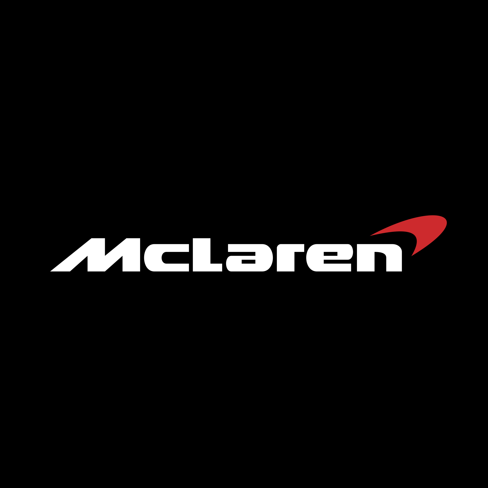

  

<h1> Innovation Showcase: The Game-Changing ‘Mermaid Tails’</h1>

Revolutionizing Aerodynamics for the 2025 F1 Season

McLaren is excited to announce an upcoming event to unveil the latest aerodynamic breakthrough set to redefine performance in Formula 1: the innovative <b>mermaid tails</b> update on our 2025 car.

Join us for an exclusive look at how this subtle yet revolutionary approach to airflow management—featuring vortex-generating curls inspired by natural forms—will optimize downforce, enhance braking cooling, and ultimately change the game on track.

<h2>What Are Mermaid Tails?</h2>

The 'mermaid tails' are aerodynamic winglets located at the base of the front wing endplates, designed to efficiently divert airflow outside the front wheels. This concept harnesses a micro-aerodynamic principle reminiscent of a successful technique from F1 history, aiming to optimize airflow outwash and vehicle stability.

Experience a new dimension in aerodynamic efficiency and witness how innovation continues to push the boundaries of racing technology.

<h2>Event Highlights</h2>

Gain insider insights from McLaren’s chief aerodynamicists and engineering team as they walk through the technical details and performance impact of the mermaid tails. The event will feature detailed presentations, interactive Q&A sessions, and exclusive behind-the-scenes content.

<h2>Join Us</h2>

Don’t miss the opportunity to learn about the innovations shaping F1's future and how McLaren plans to maintain its competitive edge with cutting-edge technology designed for speed, precision, and sustainability.

Stay tuned for event date and registration details, coming soon.

Officially hosted by McLaren Racing Communications

