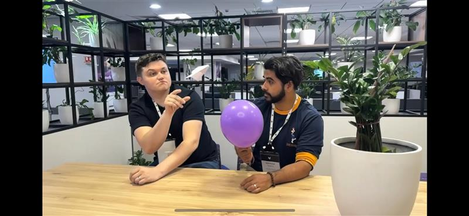

<h1>
  
  Witness Innovation in Motion
</h1>
Our symbol of speed, innovation, and precision

At NOVA, our vision drives us to be the pinnacle of speed, innovation, and precision in motorsport. Recently, a select team attended McLaren event showcasing the groundbreaking mermaid tails aerodynamic update on McLaren’s 2025 car — reflecting our core values: excellence, creativity, teamwork, integrity, and sustainability.

<h2>Excellence & Precision</h2>

These winglets optimize airflow and enhance brake cooling, delivering precise performance gains. Our NOVA team was deeply inspired by the detailed technical breakdowns and live interactions with engineers. The event offered a unique chance to ask questions, participate in discussions, and understand the real impact of micro-scale design tweaks on race performance.

Engage with the innovation. Imagine how precision engineering drives us to new frontiers in speed and control.

<h2>Innovation & Creativity</h2>

The <strong>mermaid tails</strong> embody the bold creativity essential to pushing boundaries. Our team gained fresh inspiration from sessions with McLaren engineers.

<h2>Teamwork & Respect</h2>

The event united diverse talents and industry leaders, reinforcing NOVA’s belief in collaboration, integrity, and sustainable responsibility.

This occasion reinforced NOVA’s dedication to pushing limits on and off the track — driving continuous innovation.

Prepared by NOVA Communications Team

